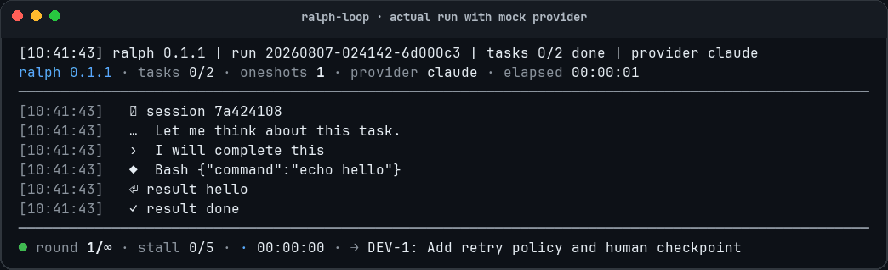

# ralph-loop

`ralph-loop` 是一个 shell-first CLI harness，用 provider CLI 的 fresh oneshot 能力驱动长任务循环执行。它把任务状态、运行日志、退出原因和 provider 原生 session 证据保存在使用者 workspace 的 `.ralph/runs/` 下，让长任务可观察、可恢复、可复盘。



> 演示使用隔离的 Mock Provider，界面与状态流来自当前 `v0.1.1` 正式实现，不会调用真实模型或消耗 Token。

## 定位

- 做什么：提供 `ralph run`、`ralph status`、`ralph watch` 等 CLI 能力，围绕使用者 workspace 的 `.ralph/TASKS.md` 组织多轮 agent oneshot 执行。
- 不做什么：不实现自有 agent 推理、任务规划或代码生成能力；不把 provider session 当作任务完成事实源；不默认 resume provider session；运行时不提供 `ralph init`。版本化部署模板由仓库构建脚本生成，而不是由运行中的 Ralph 隐式写入。
- 谁在用：维护者和 agent 协作者，用于在真实 workspace 中执行长期或多步骤开发任务。

## 快速开始

### 前置依赖

| 依赖 | 用途 |
|---|---|
| bash 4+ | 运行 ralph |
| git | workspace 变更追踪 |
| jq | meta.json 写入 |
| Claude CLI (`claude`) | Claude provider CLI —— 参考 [安装文档](https://docs.anthropic.com/en/docs/claude-code) |
| Codex CLI (`codex`) | Codex provider CLI |

这是当前生效的 provider 支持矩阵：公共入口只接受 `claude` / `codex` / `fake`，
`gemini` 在启动校验阶段即被拒绝（exit 1，不产生 run 目录）。权限边界
（Codex 固定 `--sandbox danger-full-access`，不限于 workspace 内）与审计路径见
`.ralph/README.md` §Provider 权限边界与审计证据 和 `docs/architecture/security.md`。

### 1. 部署到 workspace

```bash
cp -R <ralph-loop-repo>/release/0.1.1/. <your-workspace>/
```

部署包同时带入 `.ralph/`、`.spec/`、项目级 `AGENTS.md` 模板、`CLAUDE.md` 软链接和 `docs/README.md` 文档地图模板。已有同名文件时先人工合并，不要静默覆盖。

### 2. 配置 workspace

在 workspace 根创建 `.ralph/.env`（最小配置）：

```bash
RALPH_PROVIDER=claude                         # claude / codex
# 可选：
# RALPH_PROVIDER_EFFORT=low              # low / medium / high / none（默认不传）
# RALPH_LOOP_MAX_ROUND=20                # 单任务最大 round 数，0 = 无限（默认 0）
# RALPH_LOOP_ROUND_TIMEOUT=3600          # 单 round 超时秒数，0 = 无限（默认 0）
# RALPH_LOOP_STALL_LIMIT=5               # 单任务连续无进展 round 数（默认 5）
# RALPH_PROVIDER_MODEL=<name>            # 覆盖 provider 默认模型
# RALPH_PROVIDER_CONFIG_DIR=~/.claude-x  # 用独立账号 / API 配置跑 ralph
                                         # ralph 自动翻译为 provider 原生变量：
                                         # Claude → CLAUDE_CONFIG_DIR；Codex → CODEX_HOME
                                         # 该目录必须已包含对应 provider 登录态 / 配置
                                         # 只改变凭据/配置来源，不改变权限或沙箱模式
```

首次项目会话先根据用户目标和项目事实补齐 `AGENTS.md`、`docs/README.md` 和任务清单；任务准备好后再运行 Ralph。`.ralph/.gitignore` 已随 release 提供，负责忽略运行态文件和私有配置。

### 3. 首跑

```bash
cd <your-workspace>
./.ralph/bin/ralph run
```

### 4. 观察运行

```bash
ralph status                  # plain text：run_id / round / tasks 进度 / state / exit_reason 等
ralph status --json           # 透传 .ralph/status.json 原始 JSON
ralph watch                   # 实时监控：sticky TUI（Ctrl+C 退出）
ralph run -v                  # TTY 下显示 sticky TUI；非 TTY 自动降级 plain
```

无 `-v` 的 `ralph run` 默认仍保持 stdout silent；stderr 会打印 round 启停 marker。长 provider oneshot 未返回时，每 60 秒打印 heartbeat，包含 elapsed、当前 `provider.stdout.log` 大小和可直接 `tail -f` 的路径。

`ralph watch` 通过 `.ralph/status.json` 的当前 `run_id` / `round` tail 对应 `provider.stdout.log`；run 会在 provider oneshot 启动前更新 status 到当前 round，避免 watch 盯到上一轮日志。

底层文件仍可直接读取：

```bash
cat .ralph/runs/<run_id>/result.json            # 运行总结
ls  .ralph/runs/<run_id>/rounds/                # 每轮明细
cat .ralph/runs/<run_id>/rounds/round-001/meta.json
```

### 退出原因速查

| exit_reason | exit code | 含义 |
|---|---|---|
| `done` | 0 | 全部任务完成 |
| `provider_failed` | 2 | provider CLI 报错或崩溃 |
| `timeout` | 3 | 单轮执行超时 |
| `locked` | 6 | workspace 已有 ralph 在跑（lock） |
| `blocked_by_human` | 7 | 第一个未勾选任务前缀是 `HUMAN-`（等人类决策；不调 provider） |
| `interrupted` | 130 | SIGINT 中断 |
| `startup_failed` | 1 | 依赖缺失或初始化失败 |

退出时 ralph 会向 stderr 打印格式化总结（含 exit_reason / rounds / 完成任务 / 阻塞点 / 接力提示），同时落到 `.ralph/runs/<run_id>/exit-message.txt` 方便复制粘贴给 main agent。

### v0.1 行为说明

- `provider_failed` 会按 `RALPH_LOOP_MAX_RETRY` / `RALPH_LOOP_RETRY_SCHEDULE` 对暂时性错误重试；不可重试或超重试次数后终止 run。
- 详细架构见 `docs/architecture/overview.md`；provider 集成见 `docs/architecture/integrations.md`。

## 当前状态

- 版本：v0.1.1
- 当前开发任务：`.ralph/TASKS.md`（dogfood 模式，root `task.md` 已封版）
- 续接状态：`handoff.md`
- 工具入口：`.ralph/bin/ralph`

## 入口地图

| 想做什么 | 从哪里开始 |
|---|---|
| 查看协作与规格规范 | `.spec/README.md` |
| 查看当前开发任务（dogfood） | `.ralph/TASKS.md` |
| 查看 v0.1 历史任务 | `task.md`（已封版） |
| 查看历史设计方案 | `docs/requirements/ralph-loop/I<N>-design.md` |
| 查看历史任务归档 | `docs/requirements/ralph-loop/I<N>-FINAL-TASK.md` |
| 查看项目文档地图 | `docs/README.md` |
| 查看项目级需求 | `docs/requirements.md` |
| 查看 Ralph 需求 | `docs/requirements/ralph-loop/requirements.md` |
| 查看 Ralph 架构 | `docs/architecture/overview.md` |
| 查看 Provider 集成 | `docs/architecture/integrations.md` |
| 查看安全边界 | `docs/architecture/security.md` |
| 运行 Ralph CLI | `.ralph/bin/ralph` |
| 查看 checkpoint | `docs/checkpoints/` |
| 查看 postmortem | `docs/postmortems/` |
| 查看 roadmap | `docs/roadmap.md` |

## 项目边界

- 本仓库是 ralph-loop 工具的**开发工程**。**v0.1 后切换为 dogfood 模式** — 自用 ralph 驱动后续开发；`.ralph/TASKS.md` 是当前任务源。
- 对外部署只使用 `release/<version>/`；开发工程中的 `.ralph/` 是 dogfood 工作区，不直接复制到其他项目。
- release 包含 `.ralph/`、`.spec/`、项目级 `AGENTS.md` 模板、`CLAUDE.md` 软链接和 `docs/README.md`；运行时产物由 `.ralph/.gitignore` 排除。
- Ralph 需求沉淀在 `docs/requirements.md`（项目级）和 `docs/requirements/ralph-loop/requirements.md`（模块级）；架构和外部集成沉淀在 `docs/architecture/`。
- 历史设计方案放 `docs/requirements/ralph-loop/I<N>-design.md`；历史任务归档放 `I<N>-FINAL-TASK.md`。
- 项目过程事实写入 `docs/`，并从 `docs/README.md` 保持可发现；根 README 只在项目自身入口内容变化时更新。

<!-- setup complete -->
